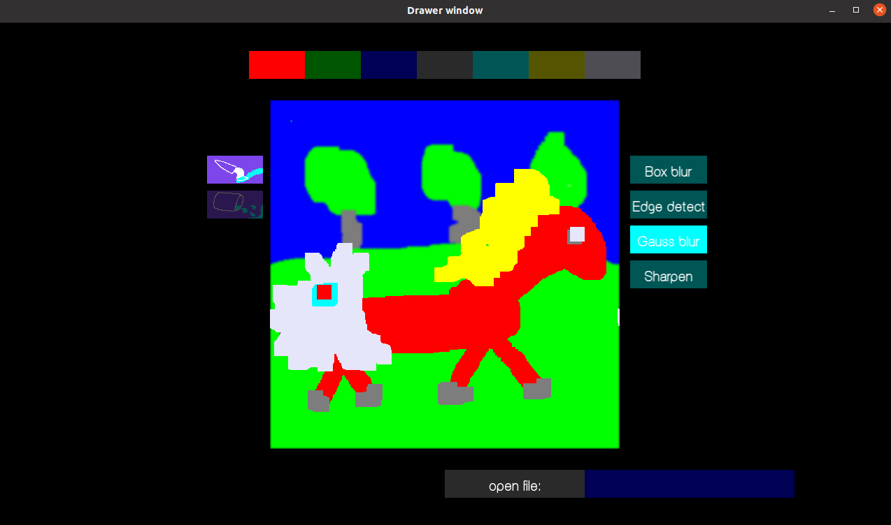

# Paint from scratch


- [What?](#what)
	- [Example 1: Hedgehog eats a horse](#example-1-hedgehog-eats-a-horse)
	- [Example 2: Load image from file](#example-2-load-image-from-file)
	- [Example 3: Blur the image](#example-3-blur-the-image)
- [Demos](#demos)
	- [Demo 1: Paint](#demo-1-paint)
	- [Demo 2: Apply filters](#demo-2-apply-filters)
- [Roadmap](#roadmap)
	- [ver 0.1: simple button](#ver-01-simple-button)
	- [ver 0.2: simple canvas](#ver-02-simple-canvas)
	- [ver 0.3: connect canvas-buttons](#ver-03-connect-canvas-buttons)
	- [ver 0.3.5: step-to-filters](#ver-035-step-to-filters)
	- [ver 0.4: filters \[@currently here\]](#ver-04-filters-currently-here)
	- [ver 0.5: Drop-down menu](#ver-05-drop-down-menu)
	- [ver 0.6: More tools](#ver-06-more-tools)
	- [ver ??: serialization](#ver--serialization)
	- [ver ??: raytracer](#ver--raytracer)
	- [features:](#features)

## What?

I develop **GUI** library **from scratch** (use only SFML drawing primitives - e.g. rectangles). This project is mostly about developing **complex OOP system**. At this stage I've already used several OOP patterns like: 
* **Compositor** for Widget system.
* **Strategy** for canvas drawing tools.
* **Decorator** for texted and textured buttons.

### Example 1: Hedgehog eats a horse



### Example 2: Load image from file


### Example 3: Blur the image


## Demos

### Demo 1: Paint


### Demo 2: Apply filters
 


## Roadmap

### ver 0.1: simple button

```
[Button]

state = PRESS | UNPRESS
position
size
color

	funcs:

process_click()
press()
unpress()
is_in_area()
```

results:
* button changes state (and color) with click
* mutex button manager (only one button can be pressed)

### ver 0.2: simple canvas

results:
* point is drawn when click on button

### ver 0.3: connect canvas-buttons

results:
* draw on canvas with active color
* draw on canvas with active instrument

Buttons:
- red, green, blue - set canvas active color 
- brush, eraser [const white brush], pouring [check pouring algo] - set canvas active instrument

Parameterize canvas with instrument (make class from instrument).

```
[Instrument]

properties: size...

	funcs:

apply(position)
```

### ver 0.3.5: step-to-filters

results:
* textured widget
* text on widget
* load picture -> text input box (button that on click gets keyboard input)

Use decorator pattern to implement decorations.

### ver 0.4: filters [@currently here]

results:
* Apply filter to every pixel when click on concrete filter

Filters:
- B&W [R=G=B = average(R,G,B)]
- inverse [R=255-R ...]
- Blur (check B2B1 video about convolution)

### ver 0.5: Drop-down menu

results:
* Drop-down menu when click on filter button

### ver 0.6: More tools

results:
* New tools (that need layering)

Tools:
- Line
- Rectangle
- Triangle
- Polyline
  
### ver ??: serialization

Tree traverse and dump
Restore from dump (check factory pattern)

### ver ??: raytracer

2 mods:
* canvas works as screen for raytracer
* paint

Objects can be added to the scene on air with
special menu. Also spheres can be dragged directly
by touching image.

(for spheres managing MVC may be applied)

### features:

* undo opearation (history of operations? queue of instruments applied? and
should be considered - how to reverse them)
* save picture (guess smth with sfml)
* load picture (guess smth with sfml and OS interaction)
* help panel
* plugins
* instruments to toolbox: line, rectangle (!!)
* set properties for instruments (size for brush)
* filters with curves
* user can add new layers, choose one to draw on it
